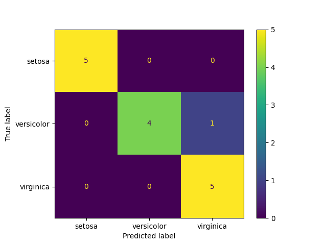
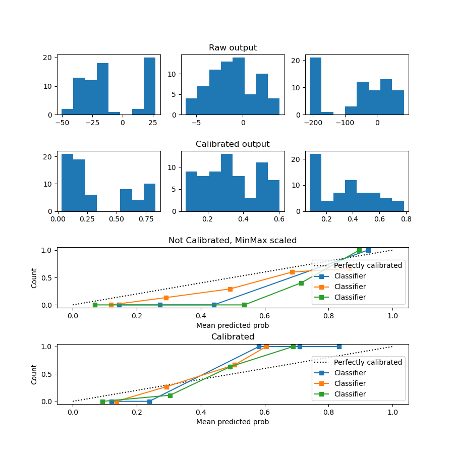

# Table of Contents

1.  [pandas, numpy - Small tasks Малые задачи](#org5a2aa85)
    1.  [task 1](#org91a635c)
    2.  [task 2 DataFrame reshape](#org7981178)
        1.  [learned RESHAPINGS guide https://pandas.pydata.org/docs/user\_guide/reshaping.html](#orgdc6b994)
2.  [perfect ML pipeline for small task](#org770bce7)
    1.  [task](#org4d4dea9)
    2.  [Steps (not strict)](#org7984745)
    3.  [Goal, problem, metric, strategy](#org631623b)
        1.  [Averaging techniques theory](#org3147c12)
        2.  [metrics exploration](#org5653074)
    4.  [data analysis for problem](#org0173304)
    5.  [common data transformation](#org48fd2d8)
    6.  [model selection](#org4719355)
        1.  [code](#org4432202)
    7.  [data preparation](#orgc1ff102)
    8.  [model finetuning and training](#org749bbdf)
    9.  [model validation](#orgcf1241c)
    10. [results analysis](#org67f5987)
    11. [model output calibration](#orgdd67e7f)
        1.  [link](#orgdb8069d)
    12. [old](#org8777341)
    13. [links](#org8262ecd)

-**- mode: Org; fill-column: 80; coding: utf-8; -**-

# pandas, numpy - Small tasks Малые задачи

## task 1

    import pandas as pd
    import numpy as np

    import sklearn

    print(np.arange(20))
    a = np.random.randint(0, 20, size=10)
    a = a.reshape((2,5))
    b = np.eye(5)
    b = b * 3
    c = np.dot(a, b)
    print(c.flatten())

    [ 0  1  2  3  4  5  6  7  8  9 10 11 12 13 14 15 16 17 18 19]
    [12. 42. 15.  6. 45.  0.  3. 45. 39.  6.]

## task 2 DataFrame reshape

    import pandas as pd
    import numpy as np
    df = pd.DataFrame({"a":[1,2,3]})
    a = []

    for x in range(12):
      s = np.random.randint(1,11, 3)
      df[str(x+1)] = s
    print(df)

       a   1  2  3  4   5  6   7  8  9  10  11  12
    0  1  10  2  6  4  10  3  10  1  9   1   7   2
    1  2   2  6  4  4   1  3   9  5  5   5   5   1
    2  3   1  2  6  7   1  4   7  7  3   9   2   6

We should transform v DataFrame to pivot table:

We will use DataFrame.melt:
<https://pandas.pydata.org/docs/user_guide/reshaping.html#reshaping>

    print(df)
    print()
    # print(v.pivot(index=["a"], columns=[1], values=[v.columns])) # , columns=["a"]
    #
    df2 = df.melt(id_vars=["a"])
    df2["variable"] = df2.variable.astype(int)
    print()
    print(df2.sort_values(by=["a", "variable"]))

    >>>    a   1  2  3  4   5  6   7  8  9  10  11  12
    0  1  10  2  6  4  10  3  10  1  9   1   7   2
    1  2   2  6  4  4   1  3   9  5  5   5   5   1
    2  3   1  2  6  7   1  4   7  7  3   9   2   6

        a  variable  value
    0   1         1     10
    3   1         2      2
    6   1         3      6
    9   1         4      4
    12  1         5     10
    15  1         6      3
    18  1         7     10
    21  1         8      1
    24  1         9      9
    27  1        10      1
    30  1        11      7
    33  1        12      2
    1   2         1      2
    4   2         2      6
    7   2         3      4
    10  2         4      4
    13  2         5      1
    16  2         6      3
    19  2         7      9
    22  2         8      5
    25  2         9      5
    28  2        10      5
    31  2        11      5
    34  2        12      1
    2   3         1      1
    5   3         2      2
    8   3         3      6
    11  3         4      7
    14  3         5      1
    17  3         6      4
    20  3         7      7
    23  3         8      7
    26  3         9      3
    29  3        10      9
    32  3        11      2
    35  3        12      6

### learned RESHAPINGS guide <https://pandas.pydata.org/docs/user_guide/reshaping.html>

1.  Resample for timeseries

    -   'M' - month boundary
    -   'A' - annual

        loan_rev_data=data['Loan Amount']
        loan_rev_data['date'] = pd.DatetimeIndex(data['Created Date'])
        loan_rev_data = loan_rev_data.set_index('date')
        monthly_loan_rev_data= loan_rev_data.resample('M').sum()

                    Loan Amount
        date
        2014-10-31  13039283.00
        2014-11-30  16097733.00
        2014-12-31  29077334.00

2.  pivot - rows to columns without aggregation

    Uses unique values from specified index / columns to form axes of the resulting DataFrame

    params: index, columns, values

        import pandas as pd
        df = pd.DataFrame({'foo': ['one', 'one', 'one', 'two', 'two','two'],
                           'bar': ['A', 'B', 'C', 'A', 'B', 'C'],
                           'baz': [1, 2, 3, 4, 5, 6],
                           'zoo': ['x', 'y', 'z', 'q', 'w', 't']})
        print(df)
        print()
        print(df.pivot(index='foo', columns='bar', values='baz'))

           foo bar  baz zoo
        0  one   A    1   x
        1  one   B    2   y
        2  one   C    3   z
        3  two   A    4   q
        4  two   B    5   w
        5  two   C    6   t

        bar  A  B  C
        foo
        one  1  2  3
        two  4  5  6

    Possible misstakes example:

        import pandas as pd
        df = pd.DataFrame({"foo": ['one', 'one', 'two', 'two'],
                           "bar": ['A', 'A2', 'B', 'C'], # new columns should not have duplicates in one index
                           "baz": [1, 2, 3, 4]})
        print(df.pivot(index='foo', columns='bar', values='baz'))

        bar    A   A2    B    C
        foo
        one  1.0  2.0  NaN  NaN
        two  NaN  NaN  3.0  4.0

    -   <https://pandas.pydata.org/docs/user_guide/reshaping.html#reshaping>
    -   <https://pandas.pydata.org/docs/reference/api/pandas.DataFrame.pivot.html>

3.  stack (levels)

        import pandas as pd
        df_single_level_cols = pd.DataFrame([[0, 1], [2, 3]],
                                            index=['cat', 'dog'],
                                            columns=['weight', 'height'])
        print(df_single_level_cols)
        print()
        print(df_single_level_cols.stack())

             weight  height
        cat       0       1
        dog       2       3

        cat  weight    0
             height    1
        dog  weight    2
             height    3
        dtype: int64

4.  melt - columns to rows

    1.  ex1

            import pandas as pd
            df = pd.DataFrame(
                {
                    "first": ["John", "Mary"],
                    "last": ["Doe", "Bo"],
                    "height": [5.5, 6.0],
                    "weight": [130, 150],
                })
            print(df)
            print()
            print(df.melt(id_vars=["first", "last"]))

              first last  height  weight
            0  John  Doe     5.5     130
            1  Mary   Bo     6.0     150

              first last variable  value
            0  John  Doe   height    5.5
            1  Mary   Bo   height    6.0
            2  John  Doe   weight  130.0
            3  Mary   Bo   weight  150.0

    2.  ex2

            import pandas as pd
            df = pd.DataFrame({'A': {0: 'a', 1: 'b', 2: 'c'},
                               'B': {0: 1, 1: 3, 2: 5},
                               'C': {0: 2, 1: 4, 2: 6}})
            print(df)
            print()
            print(pd.melt(df, id_vars=['A'], value_vars=['B']))

               A  B  C
            0  a  1  2
            1  b  3  4
            2  c  5  6

               A variable  value
            0  a        B      1
            1  b        B      3
            2  c        B      5

5.  pivot\_table - allow aggs

    1.  ex1

            import pandas as pd
            import numpy as np
            import datetime
            df = pd.DataFrame(
                {
                    "A": ["one", "one", "two", "three"] * 6,
                    "B": ["A", "B", "C"] * 8,
                    "C": ["foo", "foo", "foo", "bar", "bar", "bar"] * 4,
                    "D": np.random.randn(24),
                    "E": np.random.randn(24),
                    "F": [datetime.datetime(2013, i, 1) for i in range(1, 13)]
                    + [datetime.datetime(2013, i, 15) for i in range(1, 13)],
                })
            print(df)
            print()
            print(pd.pivot_table(df, values="D", index=["A", "B"], columns=["C"]))
            print()
            print(pd.pivot_table(df, values="D", index=["B"], columns=["A", "C"], aggfunc=np.sum))

                    A  B    C         D         E          F
            0     one  A  foo -1.484872 -0.355085 2013-01-01
            1     one  B  foo  1.262879 -0.427820 2013-02-01
            2     two  C  foo -0.986812  2.510005 2013-03-01
            3   three  A  bar -0.818121 -1.320768 2013-04-01
            4     one  B  bar -0.854259  0.558128 2013-05-01
            5     one  C  bar  0.415342  0.759633 2013-06-01
            6     two  A  foo -2.189582 -1.608356 2013-07-01
            7   three  B  foo  0.440292  0.185324 2013-08-01
            8     one  C  foo  1.923843 -0.784569 2013-09-01
            9     one  A  bar -0.124941 -0.347849 2013-10-01
            10    two  B  bar  2.034714  0.384569 2013-11-01
            11  three  C  bar  1.051574 -0.786906 2013-12-01
            12    one  A  foo  0.235524 -0.730406 2013-01-15
            13    one  B  foo  0.763698  1.077707 2013-02-15
            14    two  C  foo -1.194810 -1.392171 2013-03-15
            15  three  A  bar -0.282398  0.144657 2013-04-15
            16    one  B  bar  0.375775  0.375028 2013-05-15
            17    one  C  bar -1.494452 -2.273490 2013-06-15
            18    two  A  foo -0.288167 -1.632188 2013-07-15
            19  three  B  foo  0.985628 -0.213714 2013-08-15
            20    one  C  foo -0.831935  0.766359 2013-09-15
            21    one  A  bar  0.113553 -1.036228 2013-10-15
            22    two  B  bar -2.533144 -0.098587 2013-11-15
            23  three  C  bar -0.532944 -3.475096 2013-12-15

            C             bar       foo
            A     B
            one   A -0.005694 -0.624674
                  B -0.239242  1.013288
                  C -0.539555  0.545954
            three A -0.550259       NaN
                  B       NaN  0.712960
                  C  0.259315       NaN
            two   A       NaN -1.238875
                  B -0.249215       NaN
                  C       NaN -1.090811

            A       one               three               two
            C       bar       foo       bar      foo      bar       foo
            B
            A -0.011388 -1.249348 -1.100519      NaN      NaN -2.477749
            B -0.478484  2.026577       NaN  1.42592 -0.49843       NaN
            C -1.079110  1.091907  0.518631      NaN      NaN -2.181622

    2.  ex2

            import pandas as pd
            import numpy as np
            print(pd.pivot_table(df[["A", "B", "C", "D", "E"]], index=["A", "B"], columns=["C"]))
            print()
            print(pd.pivot_table(df, values="D", index=pd.Grouper(freq="M", key="F"), columns="C"))
            print()
            table = pd.pivot_table(df, index=["A", "B"], columns=["C"], values=["D", "E"])
            print(table.to_string(na_rep=""))
            print()
            table = df.pivot_table(
                index=["A", "B"],
                columns="C",
                values=["D", "E"],
                margins=True,
                aggfunc=np.std)
            print(table)
            print()
            print(table.stack())

                            D                   E
            C             bar       foo       bar       foo
            A     B
            one   A -0.005694 -0.624674 -0.692039 -0.542746
                  B -0.239242  1.013288  0.466578  0.324944
                  C -0.539555  0.545954 -0.756929 -0.009105
            three A -0.550259       NaN -0.588055       NaN
                  B       NaN  0.712960       NaN -0.014195
                  C  0.259315       NaN -2.131001       NaN
            two   A       NaN -1.238875       NaN -1.620272
                  B -0.249215       NaN  0.142991       NaN
                  C       NaN -1.090811       NaN  0.558917

            C                bar       foo
            F
            2013-01-31       NaN -0.624674
            2013-02-28       NaN  1.013288
            2013-03-31       NaN -1.090811
            2013-04-30 -0.550259       NaN
            2013-05-31 -0.239242       NaN
            2013-06-30 -0.539555       NaN
            2013-07-31       NaN -1.238875
            2013-08-31       NaN  0.712960
            2013-09-30       NaN  0.545954
            2013-10-31 -0.005694       NaN
            2013-11-30 -0.249215       NaN
            2013-12-31  0.259315       NaN

                            D                   E
            C             bar       foo       bar       foo
            A     B
            one   A -0.005694 -0.624674 -0.692039 -0.542746
                  B -0.239242  1.013288  0.466578  0.324944
                  C -0.539555  0.545954 -0.756929 -0.009105
            three A -0.550259           -0.588055
                  B            0.712960           -0.014195
                  C  0.259315           -2.131001
            two   A           -1.238875           -1.620272
                  B -0.249215            0.142991
                  C           -1.090811            0.558917

                            D                             E
            C             bar       foo       All       bar       foo       All
            A     B
            one   A  0.168640  1.216504  0.794031  0.486758  0.265392  0.331489
                  B  0.869766  0.352974  0.903681  0.129471  1.064568  0.624534
                  C  1.350429  1.948629  1.505450  2.144742  1.096672  1.456233
            three A  0.378814       NaN  0.378814  1.036213       NaN  1.036213
                  B       NaN  0.385611  0.385611       NaN  0.282162  0.282162
                  C  1.120423       NaN  1.120423  1.900837       NaN  1.900837
            two   A       NaN  1.344504  1.344504       NaN  0.016851  0.016851
                  B  3.229964       NaN  3.229964  0.341642       NaN  0.341642
                  C       NaN  0.147077  0.147077       NaN  2.759255  2.759255
            All      1.183840  1.247564  1.165577  1.271732  1.213956  1.205010

                                D         E
            A     B C
            one   A All  0.794031  0.331489
                    bar  0.168640  0.486758
                    foo  1.216504  0.265392
                  B All  0.903681  0.624534
                    bar  0.869766  0.129471
                    foo  0.352974  1.064568
                  C All  1.505450  1.456233
                    bar  1.350429  2.144742
                    foo  1.948629  1.096672
            three A All  0.378814  1.036213
                    bar  0.378814  1.036213
                  B All  0.385611  0.282162
                    foo  0.385611  0.282162
                  C All  1.120423  1.900837
                    bar  1.120423  1.900837
            two   A All  1.344504  0.016851
                    foo  1.344504  0.016851
                  B All  3.229964  0.341642
                    bar  3.229964  0.341642
                  C All  0.147077  2.759255
                    foo  0.147077  2.759255
            All     All  1.165577  1.205010
                    bar  1.183840  1.271732
                    foo  1.247564  1.213956

6.  pivot tables(old)

        melb_df.groupby(['Rooms', 'Type'])['Price'].mean() # иерархические индексы
        melb_df.groupby(['Rooms', 'Type'])['Price'].mean().unstack() # раскладывает таблицу в столбцы
        melb_df.pivot_table(
            values='Price',
            index='Rooms',
            columns='Type',
            fill_value=0
        ).round() # аналогично второму

7.  crosstab - frequencies

    frequency table of the factors unless an array of values and an aggregation function are passed.

        import pandas as pd
        import numpy as np
        foo, bar, dull, shiny, one, two = "foo", "bar", "dull", "shiny", "one", "two"
        a = np.array([foo, foo, bar, bar, foo, foo], dtype=object)
        b = np.array([one, one, two, one, two, one], dtype=object)
        c = np.array([dull, dull, shiny, dull, dull, shiny], dtype=object)
        print("frequencies:")
        print(pd.crosstab(a, b))
        print()
        print(pd.crosstab(a, [b, c], rownames=["a"], colnames=["b", "c"]))

        frequencies:
        col_0  one  two
        row_0
        bar      1    1
        foo      3    1

        b    one        two
        c   dull shiny dull shiny
        a
        bar    1     0    0     1
        foo    2     1    1     0

8.  cut - transform continuous variables to discrete or categorical variables

        import pandas as pd
        import numpy as np
        ages = np.array([10, 15, 13, 12, 23, 25, 28, 59, 60])
        print(pd.cut(ages, bins=3))
        print()
        print(pd.cut(ages, bins=[0, 18, 35, 70]))

        [(9.95, 26.667], (9.95, 26.667], (9.95, 26.667], (9.95, 26.667], (9.95, 26.667], (9.95, 26.667], (26.667, 43.333], (43.333, 60.0], (43.333, 60.0]]
        Categories (3, interval[float64, right]): [(9.95, 26.667] < (26.667, 43.333] < (43.333, 60.0]]

        [(0, 18], (0, 18], (0, 18], (0, 18], (18, 35], (18, 35], (18, 35], (35, 70], (35, 70]]
        Categories (3, interval[int64, right]): [(0, 18] < (18, 35] < (35, 70]]

9.  dummies

    -   pd.get\_dummies(df, prefix="new\_prefix")
    -   pd.from\_dummies(df, sep="\_")

10. factorize - categories to numbers

        import pandas as pd
        import numpy as np
        x = pd.Series(["A", "A", np.nan, "B", 3.14, np.inf])
        labels, uniques = pd.factorize(x)
        print(labels)
        print(uniques)

        [ 0  0 -1  1  2  3]
        Index(['A', 'B', 3.14, inf], dtype='object')

11. explode

        import pandas as pd
        import numpy as np
        keys = ["panda1", "panda2", "panda3"]
        values = [["eats", "shoots"], ["shoots", "leaves"], ["eats", "leaves"]]
        df = pd.DataFrame({"keys": keys, "values": values})
        print(df)
        print()
        print(df["values"].explode())
        print()
        print(df.explode("values"))

             keys            values
        0  panda1    [eats, shoots]
        1  panda2  [shoots, leaves]
        2  panda3    [eats, leaves]

        0      eats
        0    shoots
        1    shoots
        1    leaves
        2      eats
        2    leaves
        Name: values, dtype: object

             keys  values
        0  panda1    eats
        0  panda1  shoots
        1  panda2  shoots
        1  panda2  leaves
        2  panda3    eats
        2  panda3  leaves

12. assign and explode - split values to rows

        import pandas as pd
        import numpy as np
        df = pd.DataFrame([{"var1": "a,b,c,d", "var2": 1}, {"var1": "d,e,f", "var2": 2}])
        print(df)
        print()
        print(df.assign(var1=df.var1.str.split(",")).explode("var1"))

              var1  var2
        0  a,b,c,d     1
        1    d,e,f     2

          var1  var2
        0    a     1
        0    b     1
        0    c     1
        0    d     1
        1    d     2
        1    e     2
        1    f     2

# perfect ML pipeline for small task

## task

Task to use iris dataset for ML classification.

Задача состоит в использовании Iris flower датасета для
 задачи классификации.

Iris flower data set is sometimes called Anderson's Iris
 data set.

Этот датасет еще называют датасетом Андерсона, в честь
 Эдгора Андерсона, который среди своих заслуг в ботанике
 ввел термин introgressive hybridization, означающий обмен
 генами между двумя родственными, но различными видами.

This dataset is also called the Anderson dataset, in honor
 of Edgar Anderson, who, among his achievements in botany,
 introduced the term introgressive hybridization, meaning
 the exchange of genes between two related, but different
 species.

Dataset consist of 150 rows of iris flowers, 50 for each of
 3 species. 4 columns for features and 1 for species.

## Steps (not strict)

We will follow steps:

1.  goal and ML problem formulation, metrics selection,
    validation strategy
2.  data analysis for problem
3.  common data transformation, feature engineering
4.  model selection
5.  data preparation, feature selection
6.  selected model finetuning
7.  model training
8.  model validation
9.  results analysis

## Goal, problem, metric, strategy

**Goal** is to predict specie by 4 features.

**Problem** is multi-class classification for 3 classes.

All classes balanced, we will **metrics**: ROC AUC, macro precision and recall.

We have 150 observations, we should use them with maximum effeciency, that is why we use
 cross\_validation **strategy** with LeaveOneOut folds.  To choose model we split data to main and test parts as 10
 percentage stratifyed.

### Averaging techniques theory

Averaging techniques for metrics:

-   macro - compute the metric independently for each class and then take the average - treating all classes
    equally
-   weighted - weighted average for classes (score\*num\_occur\_per\_class)/totalnum
-   micro - aggregate the contributions of all classes to compute the average metric - micro-average is
    preferable if you suspect there might be class imbalance

### metrics exploration

    def _check_model_scorings(est, X, Y, kfold):
        print( '{:40} {:5} {:5}'.format("metric", "mean_accuracy", "std" ))
        for k in metrics.get_scorer_names():
            # print(k)
            results = cross_validate(est, X, Y, cv=kfold, scoring=[k])
            r = results[f'test_{k}']
            if not all(np.isnan(r)):
                print( '{:40} {:5} {:5}'.format(k, round(r.mean(), 3), round(r.std(),2)) )

    metric                                   mean_accuracy std
    accuracy                                 0.973  0.02
    adjusted_mutual_info_score               0.923  0.07
    adjusted_rand_score                      0.921  0.07
    balanced_accuracy                        0.973  0.02
    completeness_score                        0.93  0.06
    explained_variance                       0.962  0.04
    f1_macro                                 0.973  0.03
    f1_micro                                 0.973  0.02
    f1_weighted                              0.973  0.03
    fowlkes_mallows_score                    0.946  0.05
    homogeneity_score                        0.927  0.06
    jaccard_macro                             0.95  0.05
    jaccard_micro                            0.949  0.05
    jaccard_weighted                          0.95  0.05
    matthews_corrcoef                        0.962  0.04
    max_error                                 -0.6  0.49
    mutual_info_score                        1.018  0.07
    neg_log_loss                             -0.511  0.54
    neg_mean_absolute_error                  -0.027  0.02
    neg_mean_absolute_percentage_error       -0.023  0.02
    neg_mean_squared_error                   -0.027  0.02
    neg_mean_squared_log_error               -0.004   0.0
    neg_median_absolute_error                  0.0   0.0
    neg_root_mean_squared_error              -0.125  0.11
    normalized_mutual_info_score             0.928  0.06
    precision_macro                          0.977  0.02
    precision_micro                          0.973  0.02
    precision_weighted                       0.977  0.02
    r2                                        0.96  0.04
    rand_score                               0.966  0.03
    recall_macro                             0.973  0.02
    recall_micro                             0.973  0.02
    recall_weighted                          0.973  0.02
    roc_auc_ovo                              0.987  0.01
    roc_auc_ovo_weighted                     0.987  0.01
    roc_auc_ovr                              0.987  0.01
    roc_auc_ovr_weighted                     0.987  0.01
    v_measure_score                          0.928  0.06

## data analysis for problem

    import pandas as pd
    from sklearn import datasets
    import numpy as np
    d = datasets.load_iris()
    target_names = d['target_names']
    print(target_names)
    print(pd.DataFrame(d['data'], columns=d['feature_names']).describe())
    print()
    print("target:", np.unique(d['target']))

    >>> ['setosa' 'versicolor' 'virginica']
           sepal length (cm)  sepal width (cm)  petal length (cm)  petal width (cm)
    count         150.000000        150.000000         150.000000        150.000000
    mean            5.843333          3.057333           3.758000          1.199333
    std             0.828066          0.435866           1.765298          0.762238
    min             4.300000          2.000000           1.000000          0.100000
    25%             5.100000          2.800000           1.600000          0.300000
    50%             5.800000          3.000000           4.350000          1.300000
    75%             6.400000          3.300000           5.100000          1.800000
    max             7.900000          4.400000           6.900000          2.500000

    target: [0 1 2]

## common data transformation

    import pandas as pd
    from sklearn import datasets
    import numpy as np
    from sklearn.model_selection import train_test_split
    d = datasets.load_iris()
    X = d['data']
    y = d['target']
    X_train, X_test_saved, y_train, y_test_saved = train_test_split(
        X, y, test_size=0.10, random_state=42, stratify=y)
    X = X_train
    y = y_train

## model selection

We selected
 OneVsOneClassifier(estimator=LogisticRegression(multi\_class='ovr'))

just for learning.

### code

    from sklearn.model_selection import cross_val_score
    from sklearn.model_selection import StratifiedKFold, KFold

    from sklearn import linear_model
    from sklearn.model_selection import cross_val_score, cross_validate
    from sklearn.model_selection import StratifiedKFold, KFold

    from sklearn.neural_network import MLPClassifier
    from sklearn.neighbors import KNeighborsClassifier
    from sklearn.svm import SVC
    from sklearn.gaussian_process import GaussianProcessClassifier
    from sklearn.gaussian_process.kernels import RBF
    from sklearn.tree import DecisionTreeClassifier
    from sklearn.ensemble import RandomForestClassifier, AdaBoostClassifier
    from sklearn.naive_bayes import GaussianNB
    from sklearn.discriminant_analysis import QuadraticDiscriminantAnalysis
    # from sklearn.metrics import hinge_loss
    from sklearn import metrics
    from sklearn.multiclass import OneVsOneClassifier
    import sklearn

    def warn(*args, **kwargs):
        pass
    import warnings
    warnings.warn = warn

    classifiers_binary = [
            KNeighborsClassifier(5),
            SVC(kernel="linear", C=0.025),  # очень долго
            SVC(gamma=2, C=1),  # слишком долго
            GaussianProcessClassifier(1.0 * RBF(1.0)), # не хватает памяти
            DecisionTreeClassifier(max_depth=5),
            RandomForestClassifier(max_depth=5, n_estimators=10, ),  # max_features=1
            MLPClassifier(alpha=1, max_iter=1000),
            AdaBoostClassifier(),
            GaussianNB(),
            QuadraticDiscriminantAnalysis()
    ]

    def _select_metrics(est, X, Y, kfold):
        print( '{:40} {:5} {:5}'.format("metric", "mean_accuracy", "std" ))
        for k in metrics.get_scorer_names():
            # print(k)
            results = cross_validate(est, X, Y, cv=kfold, scoring=[k])
            r = results[f'test_{k}']
            if not all(np.isnan(r)):
                print( '{:40} {:5} {:5}'.format(k, round(r.mean(), 3), round(r.std(),2)) )

    def _check_model_binary(est, X, Y, kfold):
        results = cross_validate(est, X, Y, cv=kfold, scoring=['accuracy', 'roc_auc'])
        print(est.__class__.__name__)
        print("Accuracy: %f" % results['test_accuracy'].mean())
        print("AUC: %f" % results['test_roc_auc'].mean())

    def _check_model_multiclass_native(est, X, Y, kfold):
        """ https://scikit-learn.org/stable/modules/model_evaluation.html#scoring-parameter
        returns score per folds"""
        print(est)
        results = cross_validate(est, X, Y, cv=kfold,
                                 scoring=['roc_auc_ovo', 'precision_macro',
                                          'recall_macro'])
        print("ROC_AUC: %f" % results['test_roc_auc_ovo'].mean())
        print("precision_macro: %f" % results['test_precision_macro'].mean())
        print("recall_macro: %f" % results['test_recall_macro'].mean())
        print()

    def _check_model_multiclass_ovo(est, X, Y, kfold):
        """ https://scikit-learn.org/stable/modules/model_evaluation.html#scoring-parameter
        returns score per folds"""
        scoring=['accuracy', 'precision_macro',
                                          'recall_macro']
        results = cross_validate(est, X, Y, cv=kfold, scoring=scoring) #
        print(est)
        for x in scoring:
            print(x+ ": %f" % results['test_'+x].mean())
        print()

    classifiers_multiclass_nativ = [
        sklearn.naive_bayes.BernoulliNB(),
        sklearn.tree.DecisionTreeClassifier(),
        sklearn.ensemble.RandomForestClassifier(max_depth=5, n_estimators=10, ),
        sklearn.tree.ExtraTreeClassifier(),
        sklearn.ensemble.ExtraTreesClassifier(),
        sklearn.naive_bayes.GaussianNB(),
        sklearn.neighbors.KNeighborsClassifier(),
        sklearn.linear_model.LogisticRegression(multi_class="multinomial"),
        sklearn.linear_model.LogisticRegressionCV(multi_class="multinomial")
        ]

    classifiers_multiclass_ovo = [
        OneVsOneClassifier(sklearn.svm.LinearSVC(C=100.)),
        OneVsOneClassifier(sklearn.svm.SVC(kernel="linear", C=0.025)),  # очень долго
        OneVsOneClassifier(sklearn.svm.SVC(gamma=2, C=1)),  # слишком долго
        OneVsOneClassifier(sklearn.gaussian_process.GaussianProcessClassifier(1.0 * RBF(1.0))), # не хватает памяти
        OneVsOneClassifier(sklearn.neural_network.MLPClassifier(alpha=1, max_iter=1000)),
        OneVsOneClassifier(sklearn.ensemble.AdaBoostClassifier()),
        OneVsOneClassifier(sklearn.discriminant_analysis.QuadraticDiscriminantAnalysis()),
        OneVsOneClassifier(sklearn.ensemble.GradientBoostingClassifier()),
        OneVsOneClassifier(sklearn.gaussian_process.GaussianProcessClassifier()),
        OneVsOneClassifier(sklearn.linear_model.LogisticRegression(multi_class="ovr")),
        OneVsOneClassifier(sklearn.linear_model.LogisticRegressionCV(multi_class="ovr")),
        OneVsOneClassifier(sklearn.linear_model.SGDClassifier()),
        OneVsOneClassifier(sklearn.linear_model.Perceptron())
        ]

    kfold = StratifiedKFold(n_splits=5)
    # ----------- select metrics ------
    # m = linear_model.LogisticRegressionCV(max_iter=10, multi_class='multinomial')
    # m = linear_model.Lasso()
    # m=KNeighborsClassifier(5)
    # m = OneVsOneClassifier(sklearn.ensemble.AdaBoostClassifier())
    # _select_metrics(m, X, y, kfold)
    # ------------------ select model -----------
    Xscal = sklearn.preprocessing.StandardScaler().fit_transform(X)

    for est in classifiers_multiclass_nativ: # classifiers_multiclass_ovo:
        _check_model_multiclass_native(est, Xscal, y, kfold)

    for est in classifiers_multiclass_ovo: # classifiers_multiclass_ovo:
        _check_model_multiclass_ovo(est, Xscal, y, kfold)

    BernoulliNB()
    ROC_AUC: 0.891358
    precision_macro: 0.762554
    recall_macro: 0.762963

    DecisionTreeClassifier()
    ROC_AUC: 0.966667
    precision_macro: 0.959731
    recall_macro: 0.955556

    RandomForestClassifier(max_depth=5, n_estimators=10)
    ROC_AUC: 0.991564
    precision_macro: 0.954091
    recall_macro: 0.948148

    ExtraTreeClassifier()
    ROC_AUC: 0.944444
    precision_macro: 0.932609
    recall_macro: 0.925926

    ExtraTreesClassifier()
    ROC_AUC: 0.996296
    precision_macro: 0.959545
    recall_macro: 0.955556

    GaussianNB()
    ROC_AUC: 0.994239
    precision_macro: 0.965000
    recall_macro: 0.962963

    KNeighborsClassifier()
    ROC_AUC: 0.995473
    precision_macro: 0.969091
    recall_macro: 0.962963

    LogisticRegression(multi_class='multinomial')
    ROC_AUC: 0.997531
    precision_macro: 0.955000
    recall_macro: 0.948148

    LogisticRegressionCV(multi_class='multinomial')
    ROC_AUC: 0.997942
    precision_macro: 0.955000
    recall_macro: 0.948148

    OneVsOneClassifier(estimator=LinearSVC(C=100.0))
    accuracy: 0.962963
    precision_macro: 0.971212
    recall_macro: 0.962963

    OneVsOneClassifier(estimator=SVC(C=0.025, kernel='linear'))
    accuracy: 0.903704
    precision_macro: 0.908877
    recall_macro: 0.903704

    OneVsOneClassifier(estimator=SVC(C=1, gamma=2))
    accuracy: 0.948148
    precision_macro: 0.952879
    recall_macro: 0.948148

    OneVsOneClassifier(estimator=GaussianProcessClassifier(kernel=1**2 * RBF(length_scale=1)))
    accuracy: 0.955556
    precision_macro: 0.961852
    recall_macro: 0.955556

    OneVsOneClassifier(estimator=MLPClassifier(alpha=1, max_iter=1000))
    accuracy: 0.948148
    precision_macro: 0.955000
    recall_macro: 0.948148

    OneVsOneClassifier(estimator=AdaBoostClassifier())
    accuracy: 0.955556
    precision_macro: 0.959545
    recall_macro: 0.955556

    OneVsOneClassifier(estimator=QuadraticDiscriminantAnalysis())
    accuracy: 0.962963
    precision_macro: 0.968519
    recall_macro: 0.962963

    OneVsOneClassifier(estimator=GradientBoostingClassifier())
    accuracy: 0.940741
    precision_macro: 0.947424
    recall_macro: 0.940741

    OneVsOneClassifier(estimator=GaussianProcessClassifier())
    accuracy: 0.955556
    precision_macro: 0.958333
    recall_macro: 0.955556

    OneVsOneClassifier(estimator=LogisticRegression(multi_class='ovr'))
    accuracy: 0.948148
    precision_macro: 0.955000
    recall_macro: 0.948148

    OneVsOneClassifier(estimator=LogisticRegressionCV(multi_class='ovr'))
    accuracy: 0.948148
    precision_macro: 0.955000
    recall_macro: 0.948148

    OneVsOneClassifier(estimator=SGDClassifier())
    accuracy: 0.970370
    precision_macro: 0.976667
    recall_macro: 0.970370

    OneVsOneClassifier(estimator=Perceptron())
    accuracy: 0.925926
    precision_macro: 0.938333
    recall_macro: 0.925926

## data preparation

sklearn.linear\_model.LogisticRegression uses L2-penalty by
 default, which is Ridge Regression.

As Hastie,Tibshirani and Friedman points out (page 82 of the
 pdf or at page 63 of the book) <a id="fnr.1" class="footref" href="#fn.1" role="doc-backlink">1</a> Standardization of
 data is preffered.

    X = sklearn.preprocessing.StandardScaler().fit_transform(X)
    print(X[0:10])

    [[-1.37406347  0.32273255 -1.2292066  -1.31595957]
     [ 1.05870464 -0.12875858  0.82793667  1.43330011]
     [-1.73897869 -0.35450415 -1.34349233 -1.31595957]
     [ 0.45051261  0.77422368  0.94222241  1.43330011]
     [-1.00914826 -0.12875858 -1.2292066  -1.31595957]
     [-1.13078666  0.09698698 -1.28634947 -1.4468767 ]
     [ 0.69378943 -0.58024971  1.05650815  1.17146585]
     [-1.25242507 -0.12875858 -1.34349233 -1.18504244]
     [-0.15767942 -0.35450415  0.25650799  0.12412883]
     [-1.49570188  0.09698698 -1.28634947 -1.31595957]]

## model finetuning and training

    from sklearn.model_selection import GridSearchCV
    from sklearn.model_selection import cross_val_score
    from sklearn.model_selection import cross_validate
    from sklearn.multiclass import OneVsOneClassifier
    from sklearn.model_selection import LeaveOneOut

    params = {'estimator__penalty': ['none', 'l2'], 'estimator__C': [0, 0.0001, 0.001,0.01,0.1]}
    clf = GridSearchCV(OneVsOneClassifier(estimator=sklearn.linear_model.LogisticRegression(multi_class='ovr', n_jobs=2)),
                       params, cv=kfold)

    results = clf.fit(X, y)
    est = results.best_estimator_
    print(est)
    kfold = LeaveOneOut()
    results = cross_val_score(results.best_estimator_, X, y, cv=kfold)
    print("Accuracy: %f" % results.mean())
    print(results)

    scoring=['accuracy', 'precision_macro',
                                          'recall_macro']

    results = cross_validate(est, X, y, cv=kfold, scoring=scoring) #

    for x in scoring:
        print(x+ ": %f" % results['test_'+x].mean())

    /usr/lib/python3.10/site-packages/sklearn/model_selection/_search.py:968: RuntimeWarning: invalid value encountered in cast
      results["rank_%s" % key_name] = np.asarray(
    OneVsOneClassifier(estimator=LogisticRegression(C=0, multi_class='ovr',
                                                    n_jobs=2, penalty='none'))
    Accuracy: 0.970370
    [1. 1. 1. 1. 1. 1. 1. 1. 1. 1. 1. 1. 1. 1. 1. 1. 1. 1. 1. 1. 1. 1. 1. 1.
     1. 1. 1. 1. 1. 1. 1. 1. 1. 1. 1. 1. 1. 1. 1. 1. 1. 1. 1. 1. 1. 1. 1. 1.
     1. 1. 1. 1. 1. 1. 1. 1. 1. 1. 1. 1. 1. 1. 1. 1. 1. 1. 1. 1. 1. 1. 1. 1.
     1. 1. 1. 1. 1. 1. 1. 1. 1. 1. 1. 1. 1. 1. 1. 1. 1. 1. 1. 0. 1. 1. 1. 1.
     1. 1. 1. 1. 1. 1. 1. 1. 1. 1. 1. 1. 1. 1. 1. 1. 1. 1. 1. 0. 1. 1. 1. 1.
     1. 0. 1. 1. 1. 1. 1. 1. 0. 1. 1. 1. 1. 1. 1.]
    accuracy: 0.970370
    precision_macro: 0.970370
    recall_macro: 0.970370

## model validation

    from sklearn.metrics import classification_report
    from sklearn.metrics import confusion_matrix

    est = OneVsOneClassifier(
        estimator=sklearn.linear_model.LogisticRegression(
            C=0, multi_class='ovr',
            n_jobs=2, penalty='none'))
    est.fit(X,y)
    X_test = sklearn.preprocessing.StandardScaler().fit_transform(X_test_saved)
    y_pred = est.predict(X_test)
    print(y_pred)
    print(y_test_saved)
    print(classification_report(y_test_saved, y_pred))
    cm = confusion_matrix(y_test_saved, y_pred)
    print("x-redicted:0,1,2", "y-true labels: 0, 1, 2 (from top to bottom)")
    print(cm)

    [1 2 2 1 2 0 0 0 2 1 0 2 1 2 0]
    [1 2 2 1 2 0 0 0 2 1 0 2 1 1 0]
                  precision    recall  f1-score   support

               0       1.00      1.00      1.00         5
               1       1.00      0.80      0.89         5
               2       0.83      1.00      0.91         5

        accuracy                           0.93        15
       macro avg       0.94      0.93      0.93        15
    weighted avg       0.94      0.93      0.93        15

    x-redicted:0,1,2 y-true labels: 0, 1, 2 (from top to bottom)
    [[5 0 0]
     [0 4 1]
     [0 0 5]]

    mkdir ./autoimgs

    from sklearn.metrics import ConfusionMatrixDisplay
    import matplotlib.pyplot as plt
    disp = ConfusionMatrixDisplay(confusion_matrix=cm,
                                  display_labels=target_names)
    disp.plot()
    plt.savefig('./autoimgs/confusion_matrix.png')

## results analysis

results analysis:

-   we get only one mistake at validation in "versicolor"
    specie.

## model output calibration

We want to have confidence score for result of model
 inference on the prediction.

If we have 0.8 it will mean, approximately 80% actually
 belong to the positive class.

It allow making decisions under uncertainty.

OneVsRest has equal accuracy with OneVsOne. We take
 OneVsRest for clarity.

    # print(est.predict_proba(X_test))
    from sklearn.calibration import CalibratedClassifierCV
    from sklearn.multiclass import OneVsRestClassifier
    import matplotlib.pyplot as plt
    from sklearn.calibration import CalibrationDisplay
    from sklearn.preprocessing import MinMaxScaler

    # ---- plot default and calibrated classifiers
    fig = plt.figure(figsize=(9,9))
    gs = fig.add_gridspec(4,3, hspace=0.6)
    #                       left=2.1, right=0.1, bottom=0.1, top=0.9,
    #                       wspace=0.9, hspace=0.1)
    # | 1 | 2 | 3 |
    # | 4 | 5 | 6 |
    # | 7 | 7 | 7 |
    # | 8 | 8 | 8 |
    d1 = fig.add_subplot(gs[0,0])
    d2 = fig.add_subplot(gs[0,1])
    d3 = fig.add_subplot(gs[0,2])

    d4 = fig.add_subplot(gs[1,0])
    d5 = fig.add_subplot(gs[1,1])
    d6 = fig.add_subplot(gs[1,2])

    d7 = fig.add_subplot(gs[2,:])
    d8 = fig.add_subplot(gs[3,:])

    colors = plt.cm.get_cmap("Dark2")
    markers = ["^", "v", "s", "o"]
    # -- data preparation
    X_train, X_test, y_train, y_test = train_test_split(
        X, y, test_size=0.50, random_state=42, stratify=y)

    y_test # y_true
    # covert to onevsrest
    y_test_oneh = np.zeros((y_test.size, y_test.max() + 1))
    y_test_oneh[np.arange(y_test.size), y_test] = 1
    # print(y_test_oneh)

    # -- default:
    clf_default = OneVsRestClassifier(
        estimator=sklearn.linear_model.LogisticRegression(
            C=0, multi_class='ovr',
            n_jobs=2, penalty='none'))

    clf_default.fit(X_train, y_train)
    y_prob = clf_default.decision_function(X_test)
    d1.hist(y_prob[:,0], bins='auto')
    d2.hist(y_prob[:,1], bins='auto')
    d3.hist(y_prob[:,2], bins='auto')
    d2.set(title='Raw output')

    y_prob = MinMaxScaler().fit_transform(y_prob)
    CalibrationDisplay.from_predictions(y_test_oneh[:,0], y_prob[:,0],
                                               ax=d7)
    CalibrationDisplay.from_predictions(y_test_oneh[:,1], y_prob[:,1],
                                               ax=d7)
    CalibrationDisplay.from_predictions(y_test_oneh[:,2], y_prob[:,2],
                                               ax=d7)

    d7.set(title='Not Calibrated, MinMax scaled', xlabel="Mean predicted prob", ylabel="Count")
    # -- calibrated:
    clf = OneVsRestClassifier(
        estimator=sklearn.linear_model.LogisticRegression(
            C=0, multi_class='ovr',
            n_jobs=2, penalty='none'))

    cal_clf = CalibratedClassifierCV(clf, method="sigmoid",
                                     cv=StratifiedKFold(10)) # ,
    cal_clf.fit(X_train, y_train)

    # print(y_test)
    y_prob = cal_clf.predict_proba(X_test)

    d4.hist(y_prob[:,0], bins='auto')
    d5.hist(y_prob[:,1], bins='auto')
    d6.hist(y_prob[:,2], bins='auto')
    d5.set(title='Calibrated output')
    # plt.hist(y_prob, bins='auto')
    # print(clf_probs)
    # print(cal_clf_probs)

    # display = CalibrationDisplay.from_predictions(
    #         y_true
    #         ,
    #         y_test,
    #     ax=d4
    #         # n_bins=10,
    #         # name='model',
    #         # ax=ax_calibration_curve,
    #         # color=colors(0),
    #         # marker=markers[0],
    # )
    CalibrationDisplay.from_predictions(y_test_oneh[:,0], y_prob[:,0],
                                               ax=d8)
    CalibrationDisplay.from_predictions(y_test_oneh[:,1], y_prob[:,1],
                                               ax=d8)
    CalibrationDisplay.from_predictions(y_test_oneh[:,2], y_prob[:,2],
                                               ax=d8)
    d8.set(title='Calibrated', xlabel="Mean predicted prob", ylabel="Count")
    # plt.show()
    plt.savefig('./autoimgs/calibrating.png')
    # print(display)

### link

-   <https://scikit-learn.org/stable/auto_examples/calibration/plot_compare_calibration.html#sphx-glr-auto-examples-calibration-plot-compare-calibration-py>
-   <https://scikit-learn.org/stable/auto_examples/calibration/plot_calibration_multiclass.html#sphx-glr-auto-examples-calibration-plot-calibration-multiclass-py>

## old

    from sklearn import datasets
    from sklearn.linear_model import RidgeCV
    from sklearn.model_selection import cross_validate
    from sklearn.model_selection import train_test_split
    from sklearn.metrics import accuracy_score
    d = datasets.load_iris()
    X = d['data']
    y = d['target']
    X_train, X_test, y_train, y_test = train_test_split(X, y, test_size=0.33, random_state=42)
    c = RidgeCV()
    c.fit(X_train, y_train)

    accuracy_score(y_true, y_pred, normalize=False)
    print(c.predict(X_test))

## links

-   ISO/IEC DIS 23053 - Machine Learning Framework
-   2022 [2205.02302] Machine Learning Operations (MLOps) Dominik Kreuzberger, Niklas Kühl, Sebastian Hirschl
-   Probablistic Machine Learning, Kevin P. Murphy, MIT Press
-   <https://towardsdatascience.com/comprehensive-guide-on-multiclass-classification-metrics-af94cfb83fbd>
-   <https://towardsdatascience.com/comprehensive-guide-to-multiclass-classification-with-sklearn-127cc500f362>
-   select sklearn algorithms for problems <https://scikit-learn.org/stable/modules/multiclass.html>

# Footnotes

<a id="fn.1" href="#fnr.1">1</a> <https://web.stanford.edu/~hastie/Papers/ESLII.pdf>
